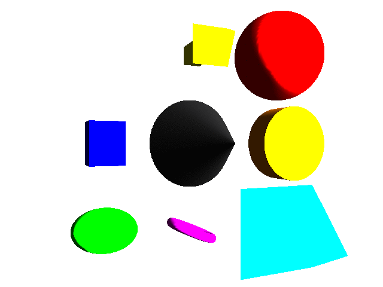
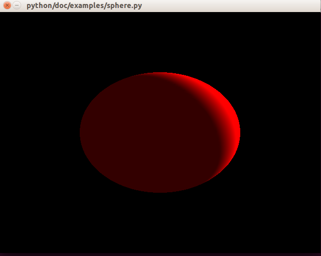

Pyglet Helper
=============

.. image:: https://travis-ci.org/CatherineH/pyglet_helper.svg?branch=master 
   :target: https://travis-ci.org/CatherineH/pyglet_helper

.. image:: https://coveralls.io/repos/github/CatherineH/pyglet_helper/badge.svg?branch=master 
   :target: https://coveralls.io/github/CatherineH/pyglet_helper?branch=master

The goal of this project is to make pyglet_ usable to people with no OpenGL experience by
reproducing the functionality of VPython_ for drawing geometric primitives.

.. _pyglet: http://www.pyglet.org/ 
.. _VPython: https://github.com/BruceSherwood/vpython-wx

Installation
------------

To Install this project, either pull it from the PyPI:
::
    pip install -i https://testpypi.python.org/pypi PygletHelper

or clone it and build from source:
::
    git clone https://github.com/CatherineH/pyglet_helper
    cd pyglet_helper
    python setup.py install

Usage
-----
The following example will show how to create a window with a sphere:

First, create a pyglet window to draw the shapes to:
::
    from pyglet.window import Window
    window = Window()

Then, create a pyglet_helper view:
::
    from pyglet_helper.objects.renderable import View
    scene = View()

Create a gl light:
::
    _light = Light()
    _light.render(scene)

Geometric objects can be added to scene. For example, to define a red sphere in the center of the view:
::
    from pyglet_helper.util import color
    _ball = Sphere(pos=(1, 1, 0), radius=0.5, color=color.red)

Finally, render the object, and run the pyglet window:
::
    _ball.render(scene)
    pyglet.app.run()

Documentation
-------------

The documentation is available on my `github page`_.

.. _github page: http://catherineh.github.io/pyglet_helper/
