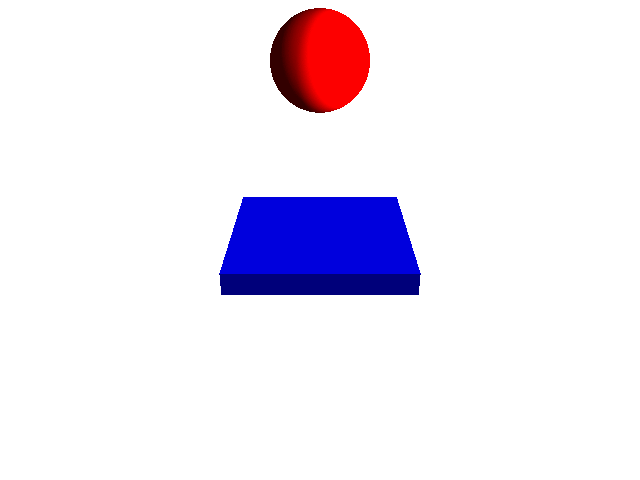

Pyglet Helper
=============

.. image:: doc/examples/all_objects.gif

.. image:: https://travis-ci.org/CatherineH/pyglet_helper.svg?branch=master 
   :target: https://travis-ci.org/CatherineH/pyglet_helper

.. image:: https://coveralls.io/repos/github/CatherineH/pyglet_helper/badge.svg?branch=master 
   :target: https://coveralls.io/github/CatherineH/pyglet_helper?branch=master

The goal of this project is to make pyglet_ usable to people with no OpenGL experience by
reproducing the functionality of VPython_ for drawing geometric primitives.

.. _pyglet: http://www.pyglet.org/ 
.. _VPython: https://github.com/BruceSherwood/vpython-wx

Installation
------------

To Install this project, either pull it from the PyPI:
::
    pip install pyglet_helper

or clone it and build from source:
::
    git clone https://github.com/CatherineH/pyglet_helper
    cd pyglet_helper
    python setup.py install

Usage
-----

pyglet_helper can draw and animation objects on a screen with or without calls to pyglet. This short tutorial will cover
 the code for both methods.

Without Pyglet
~~~~~~~~~~~~~~

First, import pyglet_helper and run vsetup. This will create an empty view and a window to draw objects to:
::
    from pyglet_helper import *
    vsetup()

Then, define an update function, which will draw a new frame based on the interval dt. In this example, a
ball descends until it hits a floor at height 1:
::
    def update(dt):
       global ball
       ball.pos = ball.pos + ball.velocity * dt
       if ball.pos[1] < 1:
           ball.velocity.y_component = -ball.velocity.y_component
       else:
           ball.velocity.y_component = ball.velocity.y_component - 9.8 * dt

Next, define a few geometric objects:
::
   floor = objects.Box(length=4, height=0.5, width=4, color=util.color.BLUE)
   ball = objects.Sphere(pos=util.Vector([0, 4, 0]), color=util.color.RED)
   ball.velocity = util.Vector([0, -1, 0])

Then, define the amount of time that passes between frames:
::
    dt = 0.01

Finally, pass the pointer to the update function to vrun to see the animation in action:
::
   vrun(update)

With Pyglet
~~~~~~~~~~~

In the above example, the calls to pyglet windows and events are abstracted away. However, if more control over
animations and window events are desired, the vsetup and vrun functions do not need to be invoked. The following code
achieves the same effect without these functions, but requires calls to pyglet.

First, import both pyglet and pyglet_helper:
::
    from pyglet_helper import *
    from pyglet import *

Next, create a pyglet Window and use its size to initialize a new scene (View):

::
   window = window.Window()
   scene = objects.View(view_height=window.height, view_width=window.width)

The update function is the same as above, but now its execution will be controlled with pyglet.schedule:

::
   def update(dt):
       global ball
       ball.pos = ball.pos + ball.velocity * dt
       if ball.pos[1] < 1:
           ball.velocity.y_component = -ball.velocity.y_component
       else:
           ball.velocity.y_component = ball.velocity.y_component - 9.8 * dt
   schedule(update)

The objects are declared as they are in the above example, but now they must be explicitly added to the scene:

::
   floor = objects.Box(length=4, height=0.5, width=4, color=util.color.BLUE)

   ball = objects.Sphere(pos=util.Vector([0, 4, 0]), color=util.color.RED)
   ball.velocity = util.Vector([0, -1, 0])

   scene.screen_objects.append(ball)
   scene.screen_objects.append(floor)

As above, define the amount of time that passes between frames:
::
    dt = 0.01

The setup() method of the scene must be invoked every time the pyglet window is drawn:

::
   @window.event
   def on_draw():
       scene.setup()

Adding lights pointing from the direction of the camera to the object will make the colors pop:

::
   _light0 = objects.Light(position=(1, 0.5, 1, 0), specular=(.5, .5, 1, 0.5))
   _light1 = objects.Light(position=(1, 0, .5, 0), specular=(.5, .5, .5, 1))
   scene.lights.append(_light0)
   scene.lights.append(_light1)

Finally, call pyglet.run to view the animation:

::
   run()

Creating animations
~~~~~~~~~~~~~~~~~~~

When using vrun, pass the arguments max_frames=99, render_images=True, and pyglet_helper will generate 99 contiguous
images of the window which can be stitched together into an animated gif, such as those in this example:

::
   vrun(update, max_frames=99, render_images=True)

Documentation
-------------

The documentation is available on Catherine Holloway's `github page`_.

.. _github page: http://catherineh.github.io/pyglet_helper/

TODO
----

- replicating all examples from the original vpython
- make_trail