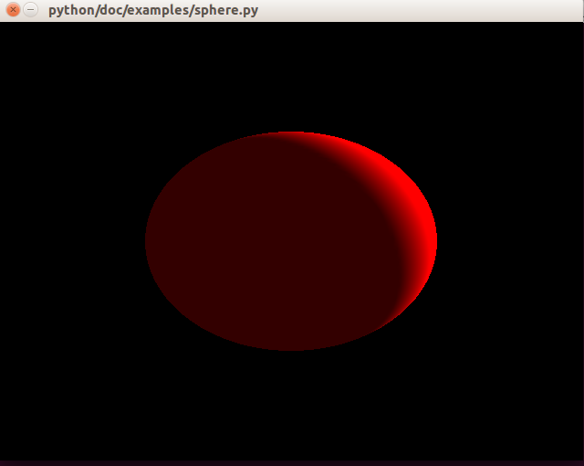

Pyglet Helper
=============


[](https://travis-ci.org/CatherineH/pyglet_helper)

[](https://coveralls.io/github/CatherineH/pyglet_helper?branch=master)


The goal of this project is to make [pyglet](http://www.pyglet.org) usable to people with no OpenGL experience by
reproducing the functionality of [VPython](https://github.com/BruceSherwood/vpython-wx) for drawing geometric primitives.


Installation
------------

To Install this project, either pull it from the PyPI:
```
pip install -i https://testpypi.python.org/pypi PygletHelper
```
or clone it and build from source:
```
git clone https://github.com/CatherineH/pyglet_helper
cd pyglet_helper
python setup.py install
```

Usage
-----
The following example will show how to create a window with a sphere:



First, create a pyglet window to draw the shapes to:
```
from pyglet.window import Window
window = Window()
```

Then, create a pyglet_helper view:
```
from pyglet_helper.objects.renderable import View
scene = View()
```

Create a gl light:
```
_light = Light()
_light.render(scene)
```

Geometric objects can be added to scene. For example, to define a red sphere in the center of the view:

```
from pyglet_helper.util import color
_ball = Sphere(pos=(1, 1, 0), radius=0.5, color=color.red)
```

Finally, render the object, and run the pyglet window:
```
_ball.render(scene)
pyglet.app.run()
```

Documentation
-------------

The documentation is available on my [github page](http://catherineh.github.io/pyglet_helper/).


